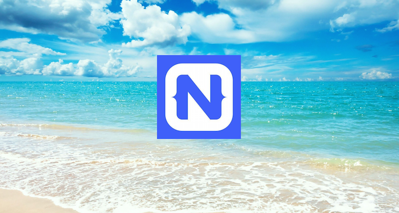

# Summer of NativeScript

**Run a meetup, get some NativeScript stickers!**

Summer is here and it's a great time to get excited about building apps with NativeScript. Why this summer? Because **if you run a NativeScript meetup in July, August, or September and let us know about it, we'll send you a cool pack of NativeScript stickers!**

If you already belong to a meetup group, now's a great time to put a NativeScript meetup on the calendar. If you don't have a group, now's a great time to start one.

Don't know what to present? No worries, we have a set of pre-prepared resources you can choose from. Customizable slide decks? Check. Video recordings of those slides being presented? Check. Hands-on labs you can work through? Check. Everything is open source, freely available, and liberally licensed—so you're free to use, copy, and alter to your heart's desire.

And the best part? We're providing *three* meetups worth of content so you can spend the whole summer with NativeScript. You can choose to run a single meetup to learn the basics, or run all three to dive deep into the NativeScript ecosystem. July's content is available now, and August's and September's are coming soon. Follow [@nativescript on Twitter](https://twitter.com/nativescript) for updates.

## Meetup #1: Welcome to NativeScript

The first meetup is all about introducing NativeScript. The slides explain what NativeScript is and how to builds apps with it. The hands-on labs walk you through the basics of starting a basic app and making changes to it.

* Customizable slides
    * [PowerPoint](july/slides.pptx)
    * [PDF](july/slides.pdf)
* Video
    * [YouTube](https://www.youtube.com/watch?v=Rw7oAu3yiik)
* Lab
    * [Instructions](july/lab.md)

## Meetup #2: Beyond the Basics

Coming soon! Check back in August.

## Meetup #3: Diving Deep

Coming soon! Check back in September.

## Stickers!

Once you have your meeting scheduled, fill out the form below so we can send your stickers on their way. Be sure to send pictures of your event to [@nativescript](https://twitter.com/nativescript) so we can help share the love.

* Your name: ...
* Your email address: ...
* Your mailing address (where to send the stickers): ...
* Meetup URL (so we can help spread the word): ...