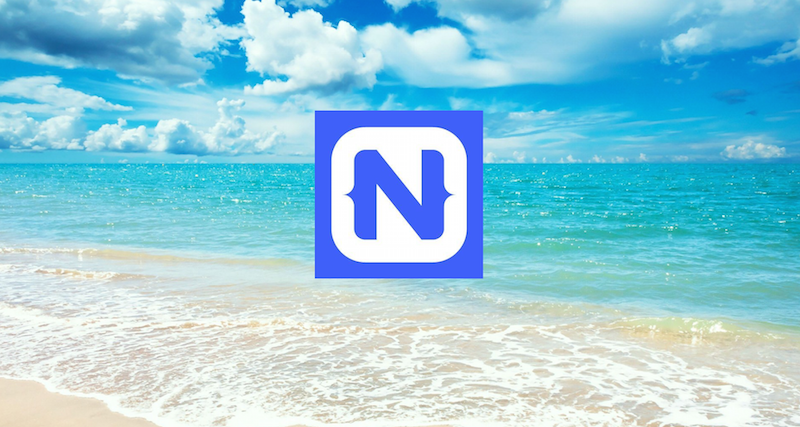

# Summer of NativeScript

**Run a meetup, get some NativeScript stickers!**

Summer is here and it's a great time to get excited about building apps NativeScript. Why this summer? Because if you run a NativeScript meetup in July, August, or September and let us know about it, we'll send you a cool pack NativeScript stickers. If you already belong to a group, now's a great time to put a NativeScript meetup on the calendar. If you don't have a group, now's a great time to start one!

Don't know what to present? No worries, we have you covered. We have a set of pre-prepared resources you can choose from. Customizable slide decks? Check. Video recordings of those slides being presented? Check. Hands-on labs you can work through? Check. You can choose the resources that work for you.

And the best part? We'll have three meetups worth of content that you can use. So you can either choose to run a single meetup to learn the basics, or run all three to dive deep into the NativeScript ecosystem.

## July Meetup: Welcome to NativeScript

* [Slides to present]()
* [Video of us presenting the slides]()
* [Lab]()

## August Meetup: Beyond the Basics

**Coming soon! Check back in July.**

## September Meetup: Diving Deep

**Coming soon! Check back in August.**

Once you have your meeting scheduled, fill out the form below so we can send your stickers on their way. Be sure to send pictures of your event to [@nativescript](https://twitter.com/nativescript) so we can help share the love.