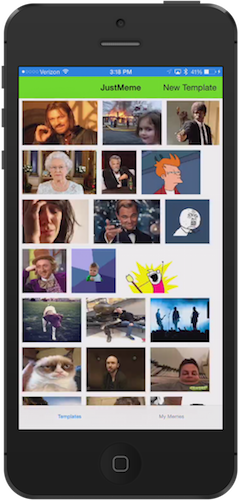

# Summer of NativeScript: August Lab

## What are we learning?

In this lab you're going to build upon the simple splash screen you built in [the first lab](https://github.com/tjvantoll/summer-of-nativescript/blob/master/july/lab.md). You'll start by creating a new page, navigating to it, and loading a few images on it. In the third lab you'll finish the app by turning those images into memes. In this lab you'll explore the following topics:

* Page navigation
* Page layout and structure
* Handling page events
* UI Controls
* Control Events
* Basic Modules

## Getting Setup

In the first lab you learned about [the difference between using NativeScript via the CLI or via AppBuilder](https://github.com/tjvantoll/summer-of-nativescript/blob/master/july/lab.md#step-1-choose-an-interface). For this lab the interface you use doesn't matter, other the how you load the starting repository.

* **CLI users only**: [Clone the lab repo](https://github.com/tjvantoll/summer-of-nativescript/blob/master/july/lab-cli.md#step-1-clone-the-lab-repo) and `cd` into the `lab-2/start` directory.
* **AppBuilder users only**: Clone <https://github.com/NativeScript/NativeScript-NEXT-Workshop-Lab2-Start> in AppBuilder. ([Here are the instructions](https://github.com/tjvantoll/summer-of-nativescript/blob/master/july/lab-appbuilder.md#step-1-clone-the-repo) for how to do that in case you've forgotten.)

Regardless of the approach you take you should be in a folder that has an `app` directory with the sample code needed to complete this lab. If you need to remember how to refresh your app after you make changes, [refer back to the first lab](https://github.com/tjvantoll/summer-of-nativescript/blob/master/july/lab.md).

### Step #0 - Creating the home.xml shell

Before we can navigate away from the splash screen you need to add something to navigate to. To start, let’s create the basic shell of your home screen that you will later redirect your splash screen page too.

**Creating Home**

1. In your components folder, `./components`, create a new folder called “home”. This will contain all of your home page’s components.
2. Every view can have three components. The layout (xml), the style (css), and the view’s code (js). When those files all have the same root name, in this case *home*, the {N} runtime will load them accordingly.
3. Create the three files that you will need to display your home page:

* `./components/home/home.xml`
* `./components/home/home.js`
* `./components/home/home.css`

With those three files in place, update your `home.xml` to include the world's simplest {N} page markup.

```xml
<Page>
	<Label text="hi from home" />
</Page>
```

Leave this page alone for now. We'll come back to it when we talk about navigation.

### Step #1 - `loaded` page event

With your home view now in place, let’s turn our attention back to the `splashscreen.xml` file that you built in the first lab.

Let’s setup the scenario. Today it’s not uncommon to use a splash screen to start loading app information that might be used later in your app. For our purposes here we’re going to fake it and use this as an opportunity to explain a few things.

To simulate some kind of business processing we’re going to call `setTimeout()` to create a slight delay. Here's the basic idea:

```JavaScript
// Pretend we’re calling some awesome service.
setTimeout(function () {
		// Do something really awesome with the data from that service.
		// Navigate.
}, 500);
```

To discuss where this code goes let's talk about [NativeScript page events](http://docs.nativescript.org/ApiReference/ui/core/view/knownEvents/README). What we want to do here is wait until the splash screen page loads, wait a second or so, and then redirect to the home page you just created. To do so, let's use the Page element's `loaded` event.

To start you need to tell your view what function should run when the `loaded` event fires. You can do this by opening `./components/splashscreen/splashscreen.xml`, and adding a `loaded="load"` attribute to your Page’s `<Page>` element. It should look something like this:

```xml
<Page xmlns="http://www.nativescript.org/tns.xsd"
			cssClass="splashPage"
			loaded="load">
```

Next, open your splash screen's code file, `splashscreen.js`. This is where you're going to place the `load` function you just referred to in XML. To do so you need to follow the [CommonJS](http://www.commonjs.org/) pattern for defining and exporting a function. In this case, you need to define a function called `load` and export the function so your XML can use it. Add the following code to your `splashscreen.js` file:

```JavaScript
exports.load = function(args) {
};
```

With that in place, your function should now run when the page’s `loaded` event fires. Next, switch your `splashscreen.js` file to use the code below which adds in a `setTimeout()` call:

```JavaScript
exports.load = function(args) {
	setTimeout(function () {
			// Do something really awesome…
			// Finished doing something awesome.
			// Now let’s navigate.
			alert('Hi There!!!');
	}, 1000);
};
```

Run your application and you should now see an alert pop up after a full second. Your next step is to alter this code to navigate to the home page.

### Step #2 - Loading your first module

To navigate to a page within your application you have to use the [frame module](http://docs.nativescript.org/ApiReference/ui/frame/README), which you can get a reference to by calling the `require()` method and passing a path to the module you would like to use—in this case `"ui/frame"`. If you’ve done any Node.js development this should be more than familiar, as Node uses the same conventions for requiring JavaScript modules.

```JavaScript
var frameModule = require("ui/frame");
```

Now that you’ve successfully loaded the frame module, you might be wondering: what’s a module and where did you find that? Well as it turns out all NativeScript modules are in a folder called `tns_modules`.

Ok, let’s back up. A [module](http://docs.nativescript.org/modules) is defined as:

> To let you access the native device and platform capabilities of your target platform, NativeScript uses a modular design pattern. All device, platform or user interface functionalities reside in separate modules. To access the functionality provided by a module, you need to require the module.

> In your project, the files for each module reside in a 	dedicated subdirectory in the {N}_modules directory. Each default module comes along with a package.json file which declares how the module should be called within your call and which file contains its respective code.

You can find the `tns_modules` folder directly within your project's `app` folder:

```
	└── app
        ├── app.css
        ├── app.js
        ├── ...
        └── tns_modules
            ├── LICENSE
            ├── application
            │   ├── application-common.js
            │   ├── application.android.js
            │   ├── application.ios.js
            │   └── package.json
            ├── camera
            │   ├── camera.android.js
            │   ├── camera.ios.js
            │   └── package.json
            └── ...
```

### Step #3 - Take me Home.xml

Now that we have your frame, you need to get a reference to our topmost frame and call its `navigate()` method. The `navigate()` method takes a number of parameters which tells it where and how to navigate.

You can get a reference to the topmost frame with the following code (don't worry about pasting this in quite yet):

```JavaScript
var top = frameModule.topmost();
```

From here you have access to the navigate method (`top.navigate()`), but before you can properly navigate you need to setup some the details on how to navigate. Let’s start by creating a `navigationEntry` variable that you will later pass to `navigate()`. There are three properties that you can set on this variable:

* `moduleName`: the path to the page that you want to be navigate to.
* `context`: an object you want to pass to the next page.
* `animated`: whether to use an animated page transitions.

With this in mind check out this example that shows what this object might look like (again, don't worry about copying code yet):

```JavaScript
var navigationEntry = {
	moduleName: "details-page",
	context: { info: "something you want to pass to your page" },
	animated: true
};
```

Ok, now let's go back to our use case. You need the `moduleName` to be a path to your `home.xml` page, specifically `"./components/home/home"`. You don't need to pass any `context` at the moment so you can omit it.

With all of this in mind refer to the code below for the updated version of your `splashscreen.js` file. Copy and paste this code in and run your application.

```JavaScript
// load the frame module
var frameModule = require("ui/frame");

// expose our load function to the page’s loaded event
exports.load = function(args) {
	// Fake some work
	setTimeout(function () {
		// Call the frameModule and navigate away
		frameModule.topmost().navigate({
			moduleName: "./components/home/home",
			animated: true
		});
	}, 1000);
};
```

If all went well you should see the application startup, pause on your splashscreen for about a second, and then redirect to the `home.xml` page.

### Step #4 - Laying out home.xml

Welcome home! Now that you're here it's time to get our house setup. Let's start by looking at what we're going to build.



This screen is comprised of a few different elements:

* 1) [`<TabView>`](http://docs.nativescript.org/ApiReference/ui/tab-view/HOW-TO.html). This is what you'll use to "swap" between the meme templates and the memes you've created.
* 2) Each `<TabView>` has a [`<TabViewItem>`](http://docs.nativescript.org/ApiReference/ui/tab-view/TabViewItem.html) that contains each individual view's content.
* 3) Each `<TabViewItem>` uses a [`<WrapLayout>`](http://docs.nativescript.org/ApiReference/ui/layouts/wrap-layout/HOW-TO.html). You will populate this element with images.
* 4) A [`<ScrollView>`](http://docs.nativescript.org/ApiReference/ui/scroll-view/HOW-TO.html) so the view scrolls when you have too many images to fit on the screen.

Let's add each of these one at a time.

**Adding the TabView**

Open your `./components/home/home.xml` file with the following code:

```xml
<Page>
	<TabView>
		<TabView.items>
			<TabViewItem title="Templates">
				<TabViewItem.view>
					<Label text="Here's where the templates go" />
				</TabViewItem.view>
			</TabViewItem>
			<TabViewItem title="My Memes">
				<TabViewItem.view>
					<Label text="Here's where the memes go" />
				</TabViewItem.view>
			</TabViewItem>
		</TabView.items>
	</TabView>
</Page>
```

If you run this app you should see two tabs that you can navigate between. At the moment each tab only has a simple label, so let's add something a bit more exciting.

**Adding the WrapLayout**

With your tabs in place the next step is to add a `<WrapLayout>` that you'll use to display images. The `<WrapLayout>` takes care of wrapping images that don't fit on the screen into a new row; it even elegantly handles switching from portrait to landscape mode.

Start by replacing each of the two `<Label>` elements currently within your `<TabViewItem.view>` elements with the `<WrapLayout>` below:

```xml
<WrapLayout>
</WrapLayout>
```

<!--

Now we're going to populate these WrapLayouts from code since we don't have a clue what kind of images we're working with. That means we will need to be able to get the correct element from JavaScript and add elements to it. Let's assign each WrapLayout a unique id that we can later use.

```xml
<WrapLayout id="templateContainer">
```

and

```xml
<WrapLayout id="myMemeContainer">
```

Easy enough. Let's also pretty this up slightly. Our images could be quite large. To make sure things don't get out of hand and we're scrolling forever, let's just set their height to only 100px. To this we can add an attribute to our WrapLayout called `itemHeight` like this `itemHeight="100"`.

```xml
<WrapLayout id="templateContainer" itemHeight="100">
<WrapLayout id="myMemeContainer" itemHeight="100">
```

**Adding the ScrollView**

Of course the massive popularity of such a smash hit has our app with 10s of memes. To make our WrapLayout scroll, we just need to wrap the WrapLayout with a 'ScrollView'. This will take care of the black magic for us.

```xml
<ScrollView>
	<WrapLayout id="templateContainer" itemHeight="100">
	</WrapLayout>
</ScrollView>
```

**Run the application**

Well not much will happen other than making sure we didn't fat finger something. Our completed TabView should look similar to the following:

***home.xml***

```xml
<TabView>
	<TabView.items>
		<TabViewItem title="Templates">
			<TabViewItem.view>
				<ScrollView>
					<WrapLayout id="templateContainer" itemHeight="100">
					</WrapLayout>
				</ScrollView>
			</TabViewItem.view>
		</TabViewItem>
		<TabViewItem title="My Memes">
			<TabViewItem.view>
				<ScrollView>
					<WrapLayout id="myMemeContainer" itemHeight="100">
					</WrapLayout>
				</ScrollView>
			</TabViewItem.view>
		</TabViewItem>
	</TabView.items>
</TabView>
```

### Step #5 - Handle Page Events

**onLoaded**

We need to get our page setup. To do such, we're going to start with implementing view's `loaded` event. We do so by adding the `loaded` attribute to our home.xml page element. 

***home.xml***

```xml
<Page 
	xmlns="http://www.nativescript.org/tns.xsd"
	loaded="load">
```

Let's implement that `load` event we just told our page to call. We will also take the page object and put it in scope so that we can use it from other functions.

***home.js***

```JavaScript
var _page;
exports.load = function(args) {
	_page = args.object;
};
```

**navigatedTo**

Now our page's `loaded` event might not fire each time we navigate the user to a given page. A page doesn't just unload when a user navigates away.

For our scenario we want to refresh all of the images every time a user is taken to the home page. To achieve this, let's also implement the page's `navigatedTo` event. It's here where we can populate/refresh our screen every time we send our users to the home page.

***home.xml***

```xml
<Page 
	xmlns="http://www.nativescript.org/tns.xsd"
	loaded="load"
	navigatedTo="navigatedTo">
```

***home.js***

```JavaScript
exports.navigatedTo = function(args) {
};
```

### Step #6 - Adding Widgets!

Now this is where the fun happens. In short, we're going to dynamically build the images seen in our WrapLayout. We'll get those Memes from two different sources:

* First from our app itself. As it turns our we've included a few templates so the app just didn't look empty on its first start.
* Next from the cloud. As you know, JustMeme is the best social Meme app in the entire world, so we'll need to call those services and get our images.

Let's add a function called `populateTemplates`. We can use this function to get our memes and build our UI tree.

```JavaScript
function populateTemplates() {
}
```

Now before we get our memes we'll need reference to the WrapLayout that we plan to populate. Earlier when we assigned one of our WrapLayouts with an id of `tempalateContainer`. Also when our page is loaded, we grabbed our page object and saved that to `_page`. On that object is a great function called `getViewById`. As you might guess, we just need to call that by passing the id of the element we would like to have a reference to, in our case that WrapLayout.

```JavaScript
var container = _page.getViewById("templateContainer");
```

With a reference to our container (the WrapLayout element), we just need to populate it with some memes.

Since our time together is short, we've actually already provided the logic to interact with local storage, call our services, and such. Take a look in the shared folder. You will find ./shared/templates/templates.js. This is a API that we've created to help you manage templates. It also depends on ./shared/everlive/everlive.js which is our wrapper for calling Telerik's Backend Services.

Having said that, we still have work to do. Let's add a reference to templates.js

```JavaScript
var templates = require("../../shared/templates/templates");
```

Since we're adding new modules let's also add the Image module.

```JavaScript
var imageModule = require("ui/image");
```

Back to `populateTemplates`. We need to call `templates.getTemplates` and pass that a callback. getTemplates (as it implies) will get all of the meme templates from the right places. It then calls our callback passing the ImageSource of the meme when it finds one.

This callback is where we will create a new Image element and add it to our WrapLayout.

Let's start by calling `getTemplates` passing our callback:

```JavaScript
templates.getTemplates(function(imageSource){
});
```

In that callback, let's create a new Image widget:

```JavaScript
var image = new imageModule.Image();
```

Assign its `imageSource` to what we received when our callback was called:

```JavaScript
image.imageSource = imageSource;
```

Lastly we just need to add that to our WrapLayout. We got reference to that earlier.

```JavaScript
container.addChild(image);
```

Rock On!

**Completed templates.getTemplates**

```JavaScript
templates.getTemplates(function(imageSource){
	var image = new imageModule.Image();
	image.imageSource = imageSource;
	container.addChild(image);
});
```

**Calling populateTemplates**

Now we just need to call our `populateTemplate` function. Where do you think we should put it? The `navigatedTo` function sounds like a great place.

**Run the application**

Are you getting images? Tap them, What happens? Nothing right? Why?

**Completed populateTemplates **

```JavaScript
function populateTemplates() {
	var container = _page.getViewById("templateContainer");

	templates.getTemplates(function(imageSource){
		var image = new imageModule.Image();
		image.imageSource = imageSource;
		
		container.addChild(image);
	});
}
```

### Step #6 - Tap that image!

Look we have images but they do nothing. Expected, right? After all it's just an image, they have no inherit behaviors and we didn't actually add anything to them. Good time to introduce Gestures!

Gestures are
	> AWESOME

Let's pull in our Gestures Module so we can use it.

```JavaScript
var gesturesModule = require("ui/gestures");
```

Now what we want to do is add a `tap` event to each image. Then when the user taps it, we're going to call a new function (`templateSelected`) whose only job is to take an ImageSource and navigate the user to another page you'll be building later (create meme), passing that ImageSource.

Let's first start by creating an empty function called `templateSelected` that accepts an ImageSource. We'll add its behavior later.

```JavaScript
function templateSelected(selectedImageSource) {	
}
```

Next we need to connect the two, the image's tap to the `templateSelected` function. 

Staying in the callback that we created to pass to `templates.getTemplates`, let's continue to extend image.

Image has a method called `observe`. Guess what `observe` takes? Yep, gestures, and a callback. Perfect! Let's pass it a tap gesture and a new callback, which in turn calls `templateSelected` passing along our image.

```JavaScript
image.observe(gesturesModule.GestureTypes.Tap, function () { 
	templateSelected(imageSource); 
});
```

**Run the application**

Go ahead and tap. Tap, Tap, Tap. Blerge, boring. Let's add a little behavior to our empty templateSelected.

```JavaScript
alert("HI THERE!");
```

Run again? Feel a little better? You should now see a dialog when you tap an image.

**Completed populateTemplate**

```JavaScript
function populateTemplates() {
	var container = _page.getViewById("templateContainer");

	templates.getTemplates(function(imageSource){
		var image = new imageModule.Image();
		image.imageSource = imageSource;
	
		image.observe(gesturesModule.GestureTypes.Tap, function () { 
			templateSelected(imageSource); 
		});
		
		container.addChild(image);
	});
}
```

### Step #7 - Navigate to Create Meme

Now we've already learned about how to navigate the user from one page to another, but this time things are a bit different. This time we need to pass the ImageSource of the image the user tapped. We need to pass this image along to the create meme page such that that page can later edit it.

Earlier we added the tapGesture to each image, and when it was tapped we called `tempalteSelected(imageSource)`, where we passed that ImageSource to that function.

Time for you to try and make that function.

**Run the application**

At this point you should be able to run your application, see the images populate the WrapLayout, and when you tap an image we should be trying to navigate the user to the create meme page or blow up if we don't have a page as a placeholder

**Completed templateSelected function**

```JavaScript
function templateSelected(selectedImageSource) {	
	frameModule.topmost().navigate({
		moduleName: "./components/create-meme/create-meme",
		context: selectedImageSource,
		animated: true
	});
}
```

### Step #8 - Extra Credit - Clearing the screen.

Earlier we created a function which would fire when the `navigatedTo` event fires. We did that to keep the images fresh every time the user is navigated to our home page.

To keep that screen fresh we need to make sure we clear the images in it. Now we could debate on the best way to achieve this, but for our purposes here we're just going to grab the WrapLayout and delete all of its children. Then we just populate it using what we just built.

What do we want to do?
* Get our container.
* Get the count on the number of children in that container.
* Loop backwards
	* removing that child.
	* Get ourselves out of potential memory issues.
	* Wash, Rinse, Repeat.

Oh yea, we need to call this from somewhere? Where?

**Question**

Why did we loop backwards?

**Run the application**

Ok, little weird here since we only have essentially two pages and the first time we run the application we're in fact going through the initial page load. 

**Completed function to clear our memes**

```JavaScript
function clearOldMemes(container) {

	for (var i = container.getChildrenCount() - 1; i >= 0; i-- ) {
		var childItem = container.getChildAt(i);
		container.removeChild(childItem);
		
		// Prevent possible memory leaks
		childItem.imageSource.setNativeSource(null);
		childItem.imageSource = null;
		childItem = null;
	}
	utils.GC();
}
```

### Step #9 - extra EXTRA credit. Build My Memes. 

Extend what we've built so far but now populate the My Memes tab. In the next lab you will be creating the create meme page. This page will take that image source we passed to it, then save it to local storage. That's great but we would love to see those memes appear on our My Memes tab in our TabView.

We've already reference our shared folder before. This is where we've abstracted away some of our logic to get the memes, call local storage, etc.

To help get you started let's recap some of the steps we've gone through to populate the WrapLayout for the meme templates tab:

1. We created a function that we called from `onNavigatedTo`.
2. In that function we got a reference to our WrapLayout.
3. Then we called our Templates API to get our images. 
4. The Templates API took a callback which did the work to populate the WrapLayout.
5. Lastly (if you did the extra credit) we created another function which cleared the UI elements for the container passed to it. This just helps keep our images fresh and new without any orphans. 

Feel free to browse around the source found in our master to see what all we did. You might find a few more items than we discussed here. 

**Run the application**

Enjoy

-->