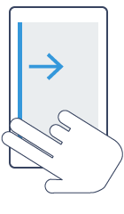

# Summer of NativeScript: June Lab—Telerik AppBuilder

## What are you learning?

You'll start by learning how to use Telerik AppBuilder—including how to start NativeScript apps, how to deploy them devices, and how see your changes during development. From there you'll start building a basic NativeScript app.

## Step 0: Create a Telerik Platform account

In order to use Telerik AppBuilder you must have a Telerik Platform account. Register for a free 30-day trial at [platform.telerik.com](https://platform.telerik.com).

## Step 1: Clone the repo

* On <https://platform.telerik.com> click the blue **Create app** button.
* On the next screen, select **Native app**, **Start from a blank app**, and then give the app a name of “JustMeme”.
* Click the green **Create app** button.
* Click the green **Create AppBuilder Native project**.
* Select **Clone repository**, use https://github.com/NativeScript/NativeScript-NEXT-Workshop-Lab1-Start.git for a Repository Uri, and “JustMeme Lab 1” for a project name.
* Click the green **Create project** button.

## Step 2: Deploy to companion app

After creating the project you're taken into the AppBuilder environment. AppBuilder offers a lot of functionality, including a full IDE and integrated version control, but you'll start by using AppBuilder to get your app onto a device.

* In the **Run** menu, select **Build**.
* Choose your device's OS (Android or iOS), make sure the **NativeScript companion app** radio button is selected, and then click the green **Next** button.
* Open the NativeScript app on your Android or iOS device.
	* (If you don't have the NativeScript app download it from the [iOS App Store](https://itunes.apple.com/us/app/nativescript/id882561588?mt=8) or [Google Play](https://play.google.com/store/apps/details?id=com.telerik.NativeScript&hl=en)).
* **Android only**: With the NativeScript app running, open the notification drawer from the top of the screen. Select the **Scan** option and use the integrated scanner to scan the QR code you see in the browser.
* **iOS only**: Within the NativeScript app, use a two-finger left-to-right swipe (see image below) from the far left to reveal the companion app menu. Select the **QR Scanner** option and use the integrated scanner to scan the QR code you see in the browser.



If all goes right you should see the text “Hello NativeScript!” on your screen. If you have multiple devices, feel free to deploy your app to all of them—it'll make testing more fun as you work through these labs.

## Step 3: AppBuilder LiveSync

Now that you have your app on your device let's make some changes to it. Start by locating the **Project Navigator** on the right-hand side of the screen. This contains the files that make up your NativeScript app. Find the **splashscreen.xml** file and double click it to open the file for editing. You should see a simple file that looks like this:

```xml
<Page>
    <Label text="Hello NativeScript!" />
</Page>
```

Next, change the `<Label>` element's `text` attribute, for instance `<Label text="OMG OMG OMG" />`. With that change in place, you *could* regenerate a QR code to view your updated app, but AppBuilder provides a much easier mechanism known as AppBuilder LiveSync. Let's look at how it works.

* **Android only**: With the NativeScript app running, open the notification drawer from the top of the screen and select the **Sync** option.
* **iOS only**: Within the NativeScript app, tap with three-fingers and hold until a popup appears (see image below).


If all goes well you should see your change on your device. Try making a few more changes and LiveSyncing them to your device so you can get the workflow down.

## Step 4: Using UI widgets

NativeScript provides a number of UI widgets you can use to build your apps. You've seen one of these already (`<Label>`), now let's add a few more. Start by changing your splashscreen.xml file to use the code below:

```xml
<Page>
    <Image src="~/images/splashScreenBackground.png" stretch="aspectFill" />
</Page>
```

The `<Image>` element's `src` attribute points at an image within the project, and the `stretch` attribute controls how NativeScript should stretch the image when it places it on the screen. All UI widgets have an API reference and a how-to guide. For example here are the `<Image>` element's [API docs](http://docs.nativescript.org/ApiReference/ui/image/Image.html) and [how-to reference](http://docs.nativescript.org/ApiReference/ui/image/HOW-TO.html).

## Step 5: (Optional) Explore

That's the end of this lab. In the next lab you'll build a more complex page that uses data binding, CSS styling, and more. If you have some extra time at the end of this lab, here are a few things you can play around with:

### Add more UI widgets

This lab used an `<Image>` element, but there are numerous other UI widgets you can add to your XML. For instance you might want to try out the following:

* [`<Label>`](http://docs.nativescript.org/ApiReference/ui/label/HOW-TO.html)
* [`<Slider>`](http://docs.nativescript.org/ApiReference/ui/slider/HOW-TO.html)
* [`<Switch>`](http://docs.nativescript.org/ApiReference/ui/switch/HOW-TO.html)
* [`<TabView>`](http://docs.nativescript.org/ApiReference/ui/tab-view/HOW-TO.html)
* [`<TextField>`](http://docs.nativescript.org/ApiReference/ui/text-field/HOW-TO.html)

### Play with layouts

In the next lab you'll learn how to use layouts to arrange your UI elements on the screen, but if you have time try playing around with the [`<StackLayout>`](http://docs.nativescript.org/ApiReference/ui/layouts/stack-layout/HOW-TO.html), and [`<GridLayout>`](http://docs.nativescript.org/ApiReference/ui/layouts/grid-layout/HOW-TO.html) elements.