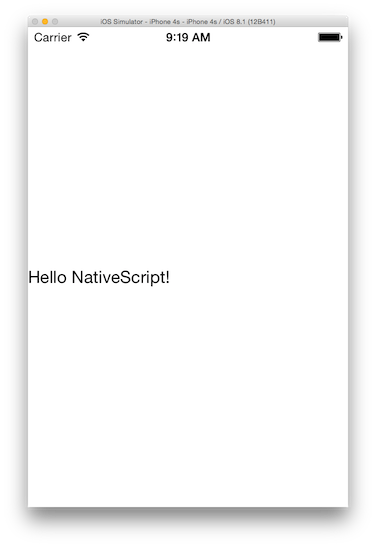
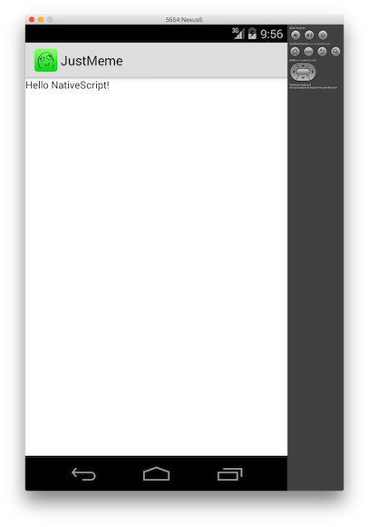

# Summer of NativeScript: July Lab—NativeScript CLI

## What are you learning?

In this lesson you'll learn how to use the NativeScript CLI—including how to start NativeScript apps, how to deploy them emulators, and how see your changes during development. From there you'll start building a basic NativeScript app.

## Step 0: Install and setup the NativeScript CLI

Your first step is to install the NativeScript CLI and its system requirements. The NativeScript docs walk through this setup in detail. Go through the operating-system-specific setup before continuing.

* [Windows](http://docs.nativescript.org/setup/ns-cli-setup/ns-setup-win.html)
* [OS X](http://docs.nativescript.org/setup/ns-cli-setup/ns-setup-os-x.html)
* [Linux](http://docs.nativescript.org/setup/ns-cli-setup/ns-setup-linux.html)

When you're done run `nativescript` or `tns` from your terminal of choice.

```
$ tns
```

If you see the big list of commands shown below you're ready to go.

```
$ tns
# NativeScript
┌─────────┬────────────────────────────────────────────────────────────────┐
│ Usage   │ Synopsis                                                       │
│ General │ $ tns <Command> [Command Parameters] [--command <Options>]     │
│ Alias   │ $ nativescript <Command> [Command Parameters] [--command       │
│         │ <Options>]                                                     │
└─────────┴────────────────────────────────────────────────────────────────┘

## General Commands
...
```

## Step 1: Clone the lab repo

Next, clone the repo that contains the starting point for this app:

```
$ git clone https://github.com/tjvantoll/summer-of-nativescript-lab.git
```

Then change into the first lab's directory so you can work with this lab's project:

```
$ cd summer-of-nativescript-lab/lab-1
```

## Step 2: Add platforms

Before you can run this app, NativeScript needs to initialize a platform-specific native project for each platform you intend to target. Start by adding the Android platform:

```
$ tns platform add android
```

If you're on a Mac, add the iOS platform next:

```
$ tns platform add ios
```

This operation uses the native SDKs to initialize platform-specific projects and places the generated contents in your app's `platforms` directory. Later on, the NativeScript CLI will use the tools of the native SDKs to build these platform-specific projects into truly native application packages.

## Step 3: Run your app

After adding platform(s), you're all set to run the sample app and see what it looks like. If you're on a Mac start by running the app in an iOS simulator:

```
$ tns run ios --emulator
```

If all went well you should see something like this:



Next run your app on Android:

```
$ tns run android --emulator
```

If all went well you should see your app running in an Android emulator:



## Step 4: Make changes

Now that you have your app on your device let's make some changes to it. Start by opening the `app/views/splashscreen/splashscreen.xml` file in your text editor of choice. You should see a simple file that looks like this:

```xml
<Page>
    <Label text="Hello NativeScript!" />
</Page>
```

Change the `<Label>` element's `text` attribute, for instance `<Label text="OMG OMG OMG" />`, and then return to your terminal to run `tns run android --emulator` or `tns run ios --emulator` again. You should see the change reflected in your emulator.

> **Note**: In the upcoming NativeScript 1.2 release (~July), the NativeScript CLI will automatically reload your app after every change (see <https://github.com/NativeScript/ios-runtime/issues/97>). If you're interested in this type of setup today, try [this Sublime Text workflow](http://developer.telerik.com/featured/a-nativescript-development-workflow-for-sublime-text/), or [this nativescript-emulator-reload npm module](https://www.npmjs.com/package/nativescript-emulator-reload).

## Step 5: Using UI widgets

NativeScript provides a number of UI widgets you can use to build your apps. You've seen one of these already (`<Label>`), now let's add a few more. Start by changing your splashscreen.xml file to use the code below:

```xml
<Page>
    <Image src="~/images/splashScreenBackground.png" stretch="aspectFill" />
</Page>
```

Run your app to see this change in action. The `<Image>` element's `src` attribute points at an image within the project, and the `stretch` attribute controls how NativeScript should stretch the image when it places it on the screen. All UI widgets have an API reference and a how-to guide. For example here are the `<Image>` element's [API docs](http://docs.nativescript.org/ApiReference/ui/image/Image.html) and [how-to reference](http://docs.nativescript.org/ApiReference/ui/image/HOW-TO.html).

## Step 6: (Optional) Explore

That's the end of this lab. In the next lab you'll build a more complex page that uses data binding, CSS styling, and more. If you have some extra time at the end of this lab, here are a few things you can play around with:

### Add more UI widgets

This lab used an `<Image>` element, but there are numerous other UI widgets you can add to your XML. For instance you might want to try out the following:

* [`<Label>`](http://docs.nativescript.org/ApiReference/ui/label/HOW-TO.html)
* [`<Slider>`](http://docs.nativescript.org/ApiReference/ui/slider/HOW-TO.html)
* [`<Switch>`](http://docs.nativescript.org/ApiReference/ui/switch/HOW-TO.html)
* [`<TabView>`](http://docs.nativescript.org/ApiReference/ui/tab-view/HOW-TO.html)
* [`<TextField>`](http://docs.nativescript.org/ApiReference/ui/text-field/HOW-TO.html)

### Play with layouts

In the next lab you'll learn how to use layouts to arrange your UI elements on the screen, but if you have time try playing around with the [`<StackLayout>`](http://docs.nativescript.org/ApiReference/ui/layouts/stack-layout/HOW-TO.html), and [`<GridLayout>`](http://docs.nativescript.org/ApiReference/ui/layouts/grid-layout/HOW-TO.html) elements.
