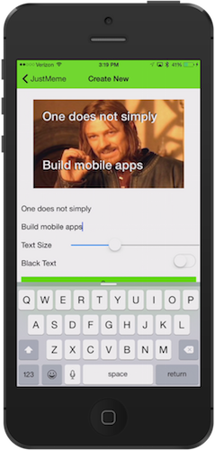
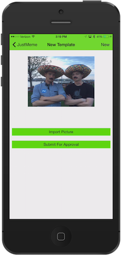

# Summer of NativeScript: July Lab

## What you're building

In the Summer of NativeScript labs you'll be building parts of JustMeme: a NativeScript-built iOS and Android app for creating memes and sharing them with your friends. If you want to see what the finished app looks like, you can [check out the app's source on GitHub](https://github.com/NativeScript/sample-JustMeme), or [download the app from the iOS App Store](https://itunes.apple.com/us/app/justmeme/id989340374?mt=8).

## Step #1: Choose an Interface

There are two ways to use NativeScript: through its CLI or through [Telerik AppBuilder](http://www.telerik.com/appbuilder). Although the NativeScript framework itself is the same regardless of whether you use the CLI or AppBuilder, the way you interace with NativeScript—how you run your app, how you change configuration files, and so forth—differs based on the interface you choose.

### Option #1: NativeScript CLI

The [NativeScript CLI](https://github.com/NativeScript/NativeScript-cli) lets you develop your apps locally and free of charge. However, you must setup your system with the necessary requirements to perform iOS and Android builds. For instance, you must have a Mac to build iOS apps with the NativeScript CLI.

### Option #2: Telerik AppBuilder

Telerik AppBuilder provides a number of tools and services for NativeScript apps—including an in-browser IDE, a Windows IDE, and an extension for Visual Studio. Telerik AppBuilder provides a cloud build service, meaning you can build iOS and Android apps on any OS without worrying about your development machine's system requirements.

Telerik AppBuilder is a [paid product](https://www.telerik.com/purchase/appbuilder), but everyone gets a free 30-day trial to evaluate the product. Telerik AppBuilder is part of the [Telerik Platform](http://www.telerik.com/platform), which offers additional tools and services for NativeScript apps, such as push notifications, cloud data, analytics, and more.

## Step #2: Start an App

Use the links below to get started building apps with NativeScript. Feel free to continue using the interface you're most comfortable with (CLI or AppBuilder), or to go through both to help you decide which interface to use.

* [**Go through the NativeScript CLI lab**](lab-cli.md)
* [**Go through the Telerik AppBuilder lab**](lab-appbuilder.md)

## Recommended reading

After going through the lab, here are some articles you might want to read to learn more about NativeScript:

* [Getting Started with NativeScript](http://developer.telerik.com/featured/getting-started-nativescript/)
* [How NativeScript Works](http://developer.telerik.com/featured/nativescript-works/)
* [Building Your Own NativeScript Modules for npm](http://developer.telerik.com/featured/building-your-own-nativescript-modules-for-npm/)
* [Customize the iOS Navigation Bar / Status Bar with NativeScript](http://developer.telerik.com/featured/customizing-ios-navigation-bar-status-bar-nativescript/)
* [Demystifying NativeScript Layouts](http://developer.telerik.com/featured/demystifying-nativescript-layouts/)
* [Supporting Multiple Screen Resolutions in Your NativeScript App](https://www.nativescript.org/blog/supporting-multiple-screen-resolutions-in-your-nativescript-app)
* [Calcu{N}ator—the NativeScript Calculator](https://www.nativescript.org/blog/calcunator-the-nativescript-calculator)