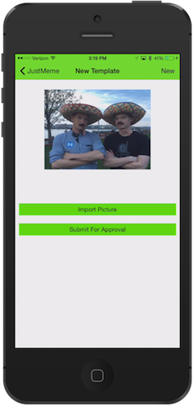

# Summer of NativeScript: July Lab

## What you're building

In these series of labs you'll be building JustMeme: a NativeScript-built iOS and Android app for creating memes and sharing them with your friends. If you want to see what the finished app looks like, you can [check it out on GitHub](https://github.com/NativeScript/sample-JustMeme), or [download it from the iOS app store](https://itunes.apple.com/us/app/justmeme/id989340374?mt=8).

## Getting started

There are two ways to use NativeScript: through its CLI or through Telerik AppBuilder. Even though NativeScript itself is the same regardless of the option you choose, the way you interace with NativeScript—how you run your app, how you change configuration files, and so forth—differs based on the interface you choose. Both options are summarized below.

## Option #1: NativeScript CLI

The [NativeScript CLI](https://github.com/NativeScript/NativeScript-cli) lets you develop your apps locally and free of charge. However, you must setup your system with the necessary requirements to perform iOS and Android builds. For instance, you must have a Mac to build iOS apps with the NativeScript CLI.

## Option #2: Telerik AppBuilder

Telerik AppBuilder provides a number of tools and services for NativeScript apps—including an in-browser IDE, a Windows IDE, and an extension for Visual Studio. Telerik AppBuilder provides a cloud build service, meaning you can build iOS and Android apps on any OS without worrying about your development machine's system requirements.

Telerik AppBuilder is a [paid product](https://www.telerik.com/purchase/appbuilder), but everyone gets a free 30-day trial to evaluate the product. Telerik AppBuilder is part of the [Telerik Platform](http://www.telerik.com/platform), which offers additional tools and services for NativeScript apps, such as push notifications, cloud data, analytics, and more.

## Choose an option

Click one of the links below to continue with the lab, or try both to help you decide which interface to use.

[**Go through the NativeScript CLI lab**](lab-cli.md)
[**Go through the Telerik AppBuilder lab**](lab-appbuilder.md)