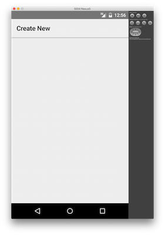
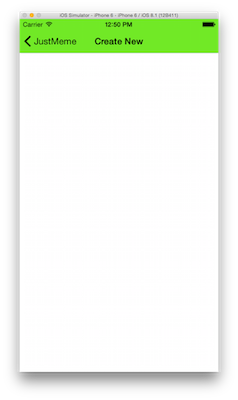

# Summer of NativeScript: September Lab

## What are you learning?

In this you're going to extend the basic app you built in the first two labs and add the ability to create memes. Along the way you'll learn about the following NativeScript concepts:

* Accessing iOS and Android APIs
* Using npm modules
* Using NativeScript plugins

## Table of contents

* [Step 0: Getting setup](#step-0)
* [Step 1: Add boilerplate](#step-1)
* [Step 2: Add in native code](#step-2)
* [Step 3: Advanced native code usage](#step-3)
* [Step 4: Using npm modules](#step-4)
* [Step 5: Using NativeScript plugins](#step-5)

<h2 id="step-0">Step 0: Getting setup</h2>

This lab uses the NativeScript CLI for all of its examples. You can [refer back to the first lab](https://github.com/tjvantoll/summer-of-nativescript/blob/master/july/lab-cli.md) if you're having trouble getting the NativeScript CLI up and running.

To start this lab run the following commands:

```
$ git clone https://github.com/tjvantoll/summer-of-nativescript-lab.git
$ cd lab-3/start
```

From there run `tns platform add android` and `tns platform add ios` (if you're on a Mac) so you're ready run your app on both platforms. If you run the app (`tns run ios --emulator` or `tns run android --emulator`) and click on an image you should see the screen below:




This screen is the create meme screen, and it's what you'll be building throughout this lab. Here's what the final state of this app will be:


Let's get started.

<h2 id="step-1">Step 1: Add boilerplate</h2>

The first thing you're going to need is a bit of boilerplate code. Start by opening `app/views/create-meme/create-meme.xml` and replace the `<!-- code goes here -->` comment with the following XML:

```xml
<Image imageSource="{{ memeImage }}" />
<TextField hint="Top text" text="{{ topText }}" />
<TextField hint="Bottom text" text="{{ bottomText }}" />

<GridLayout rows="auto, auto" columns="auto, *">
	<Label row="0" col="0" cssClass="settingsLeft" text="Text Size" />
	<Slider row="0" col="1" cssClass="settingRight" value="{{ fontSize }}" minValue="10" maxValue="100" />

	<Label row="1" col="0" cssClass="settingsLeft" text="Black Text" />
	<Switch row="1" col="1" cssClass="settingsRight" checked="{{ isBlackText }}" />
</GridLayout>
```

This adds a placeholder for an image (`<Image>`), and four form controls that you'll soon use to manipulate the image itself. For now notice that the image's `imageSource` attribute is set to `{{ memeImage }}`. Let's switch over to this page's JavaScript to fill that attribute with an actual image.

You may recall that [NativeScript's `navigate()` method](https://docs.nativescript.org/navigation#navigation) gives you pass data from one page to the next. In the case of this app, the home page is already passing the image the user selects to the create meme page, so all you need to do get a reference to that image and set in on this new page's view model.

To do so, open `app/views/create-meme/create-meme.js` and paste in the following code:

``` javascript
var observable = require("data/observable");
var viewModel = new observable.Observable();
var page;

exports.loaded = function(args) {
	page = args.object;
	page.bindingContext = viewModel;
};
exports.navigatedTo = function() {
	viewModel.set("memeImage", page.navigationContext);
};
```

The `loaded()` function takes care of setting the page's `bindingContext`, or the object accessible with the `{{ }}` syntax, and the `navigatedTo()` function sets the view model's `"memeImage"` property, so that `<Image imageSource="{{ memeImage }}" />` now renders. If you run your app again you should see images appearing on the new create meme page.

<h2 id="step-2">Step 2: Add in native code</h2>

NativeScript's defining feature is that it gives you direct access to iOS and Android APIs in JavaScript directly. This gives your NativeScript app the power to do anything an iOS or Android app can do—in JavaScript.

Going back to our app, think for a minute about what you need to do to create a meme. To generate an image file, you need to rasterize text onto an image file, and iOS and Android both have APIs to make this possible.

Before diving into the code that writes text on images, which is admittedly a bit complex, let's look at a simple example of how accessing native APIs works.

Paste the following line of code at the very top of `create-meme.js`.

```js
var frame = require("ui/frame");
```

And then paste the following inside the `exports.loaded()` function:

```js
if (frame.topmost().ios) {
	var navBar = frame.topmost().ios.controller.navigationBar;
	navBar.barTintColor = UIColor.colorWithRedGreenBlueAlpha(1, 0, 0, 0);
}
```

This code get a reference to the iOS [`UINavigationController`](https://developer.apple.com/library/prerelease/ios/documentation/UIKit/Reference/UINavigationBar_Class/index.html) class and sets its [`barTintColor`](https://developer.apple.com/library/prerelease/ios/documentation/UIKit/Reference/UINavigationBar_Class/index.html#//apple_ref/occ/instp/UINavigationBar/barTintColor) to an rgb value that represents red. The end result is the navigation bar now appears red instead of the green that your JustMeme app usually uses.

Notice just how easy NativeScript makes accessing these native APIs. There's no abstraction you have to go through to use APIs like [`UIColor`](https://developer.apple.com/library/ios/documentation/UIKit/Reference/UIColor_Class/)—you just type `UIColor`.

With simple examples like this it's reasonably simple to see how to convert Objective-C code to JavaScript, but things can get complex . When you run into these situations refer to the NativeScript docs, which walk through how to convert Objective-C iOS code and Java Android code into JavaScript code NativeScript can run. (Here are the [iOS docs](http://docs.nativescript.org/runtimes/ios/Overview); here are the [Android docs](http://docs.nativescript.org/runtimes/android/overview)).

Now that you've seen a basic example, let's move onto adding text to images.

<h2 id="step-3">Step 3: Advanced native code usage</h2>

Let's start by adding the code that makes the text work and then discuss how it works. First, add the following two lines of code to the top of `create-meme.js`:

```js
var originalImage;
var imageManipulation = require("../../shared/image-manipulation/image-manipulation");
```

Next, replace the current `exports.navigatedTo()` function with the one shown below:

``` js
exports.navigatedTo = function() {
	// Save a reference to the original image
	originalImage = page.navigationContext;

	// Show the starting image on the screen
	viewModel.set("memeImage", originalImage);

	// Listen for changes to the form controls
	viewModel.addEventListener(observable.Observable.propertyChangeEvent, function(changes) {
		// No need to redraw text if the image changed
		if (changes.propertyName === "memeImage") {
			return;
		}

		// Add text to the original image
		var image = imageManipulation.addText({
			image: originalImage,
			topText: viewModel.get("topText"),
			bottomText: viewModel.get("bottomText"),
			fontSize: viewModel.get("fontSize"),
			isBlackText: viewModel.get("isBlackText")
		});

		// Show the new image, with text applied, on the screen
		viewModel.set("memeImage", image);
	});
};
```

Let's break down what's happening here, starting with the line below:

```js
viewModel.addEventListener(observable.Observable.propertyChangeEvent, function(){ ... });
```

To understand this code, recall that `viewModel` is an observable that you used to bind XML UI components to JavaScript properties. Therefore when the value of the form controls bound to this object change—including the two textfields, the font size slider, and the text color switch—NativeScript fires a `propertyChangeEvent` that you can subscribe to, which is exactly what the code above does; therefore anytime the user types a letter, or moves the slider, you'll run the code within this `propertyChangeEvent` handler.

The magic of actually adding text to the images happens with this call to the `imageManipulation` module:

```
// Add text to the original image
var image = imageManipulation.addText({
    image: originalImage,
    topText: viewModel.get("topText"),
    bottomText: viewModel.get("bottomText"),
    fontSize: viewModel.get("fontSize"),
    isBlackText: viewModel.get("isBlackText")
});
```

To see what's actually happening here, open your app's `app/shared/image-manipulation/image-manipulation.ios.js` and `app/shared/image-manipulation/image-manipulation.android.js` files. You'll see a bunch of Android and iOS APIs that used to actually draw text on images.

Let's experiment with a few of these APIs to see just how easy NativeScript makes it to play with native code. For example find the line in `image-manipulation.ios.js` that uses the `UIFont` class:

```js
font = UIFont.boldSystemFontOfSize(fontSize);
```

Try playing with the [`UIFont` API](https://developer.apple.com/library/ios/documentation/UIKit/Reference/UIFont_Class/) to see ways you can change the text. For instance, change `boldSystemFontOfSize` to `italicSystemFontOfSize` and run the app again to see what happens.

In `image-manipulation.android.js`, find the line that uses `android.graphics.Typeface`:

```js
var type = android.graphics.Typeface.create("Helvetica",
	android.graphics.Typeface.BOLD);
```

Try playing with the [Android Typeface API](http://developer.android.com/reference/android/graphics/Typeface.html) to display text various ways. For instance, try changing the font family from `"Helvetica"`, or change `android.graphics.Typeface.BOLD` to `android.graphics.Typeface.ITALIC`.

When you're ready, and when the meme text matches your personal preferences, let's move onto see how we can use npm modules in this app.

<h2 id="step-4">Step 4: Using npm modules</h2>

If you're on a low-end device you may have noticed a problem with our text implementation: if you continuously slide the create meme page's slider, your code generates a *lot* of images in a short amount of time. Some devices are able to handle this load, but many are not.

The JavaScript world has a well established solution to this problem known as [debouncing](http://davidwalsh.name/javascript-debounce-function). Essentially, instead calling a functioning continuously, a debounced function is only called every n milliseconds. In our case, debouncing the image generation will greatly reduce the number of images generated, and improve this app's performance substantially.

Instead of writing our own debounce function, which can be a be tricky, it's far easier to simply install a library that has a debounce function already implemented. In this lab we'll use [lodash](https://www.npmjs.com/package/lodash).

Start by installing lodash from npm in the root of your application (aka you should be in the `lab-3/start` folder).

```
$ npm install lodash --save
```

This installs lodash in your NativeScript app, and stores your project's dependency on lodash in your app's `package.json` file. Next, add the following code to the top of your `create-meme.js` file:

```js
var _ = require("lodash");
```

Next, paste the following code at the bottom of `create-meme.js`:

``` js
var generateImage = _.debounce(function() {
	var image = imageManipulation.addText({
		image: originalImage,
		topText: viewModel.get("topText"),
		bottomText: viewModel.get("bottomText"),
		fontSize: viewModel.get("fontSize"),
		isBlackText: viewModel.get("isBlackText")
	});
	viewModel.set("memeImage", image);
}, 10, { leading: true });
```

This calls lodash's debounce function, which returns a function that you can call continuously, but will only actually run every 10 milliseconds (because of the second argument you pass to `_.debounce()`). Succinctly, using this function guarantees that we only generate an image every 10 milliseconds.

To use this function, change your `exports.navigatedTo()` function to use the code below:

```js
exports.navigatedTo = function() {
	originalImage = page.navigationContext;
	viewModel.set("memeImage", page.navigationContext);
	viewModel.addEventListener(observable.Observable.propertyChangeEvent, function(changes) {
		if (changes.propertyName === "memeImage") {
			return;
		}
		generateImage();
	});
};
```

Finally, try out this code to see if you can see a performance difference. It's a bit easier to see exactly what this code is doing if you try changing `10` to a far larger value, such as `1000`.

This example shows just how simple it is to use npm modules in your NativeScript apps. That ease of use extends to the next NativeScript you're going to try out: NativeScript plugins.

<h2 id="step-5">Step 5: Using NativeScript plugins</h2>

NativeScript plugins are npm modules that have the added ability to run native code. As such, using a NativeScript plugin is pretty much exactly like using any other npm module. The one difference is in how you install plugins, as installing NativeScript plugins requires the `tns plugin add` command.

Let's see how NativeScript plugins work by adding the [NativeScript social share](https://github.com/tjvantoll/nativescript-social-share) plugin to JustMeme. Start by running the following command in the root of your project:

```
$ tns plugin add nativescript-social-share
```

Like `npm install`, `tns plugin add` retrieves the necessary code from npm, and saves the new dependency in your project's `package.json` file. However, the `tns plugin add` command does a few additional things, such as processing any iOS and Android libraries and configuration files that the plugin uses. For instance the [NativeScript flashlight plugin](https://github.com/tjvantoll/nativescript-flashlight) uses an `AndroidManifest.xml` snippet to set the appropriate Android permissions needed for an app to use the camera.

To use the social share plugin start by adding the following line of code to the top of `create-meme.js`:

```js
var socialShare = require("nativescript-social-share");
```

This imports the social share plugin's JavaScript module so you can use it. To do so, first you're going to add a new UI component that gives the user the ability to share.

Return to `create-meme.xml` and locate the `<Page.actionBar>` UI component. Replace the current `<Page.actionBar>` with the code shown below:

```xml
<Page.actionBar>
	<ActionBar title="Create New">
		<ActionBar.actionItems>
			<ActionItem text="Share" tap="share" ios.position="right" />
		</ActionBar.actionItems>
	</ActionBar>
</Page.actionBar>
```

This adds a share button on the top-right corner of the create meme page. The `<ActionItem>` includes a `tap` handler that calls a `share()` method, so your next step is to create that function.

Return to `create-meme.js` and paste the following function at the bottom of the file:

```js
exports.share = function() {
	socialShare.shareImage(viewModel.get("memeImage"));
};
```

Run the app and you should now have the ability to share memes using your device's native sharing widget!

Overall, the ability to use npm modules and NativeScript plugins greatly expands the number of things you're able to do in a NativeScript app. Need utility functionality for dealing with arrays and objects? Use [lodash](https://www.npmjs.com/package/lodash) or [underscore](https://www.npmjs.com/package/underscore). Need to compose emails in your app? Try out the [NativeScript email plugin](https://www.npmjs.com/package/nativescript-email).

If you're looking for plugins start by doing a [search for NativeScript on npm](https://www.npmjs.com/search?q=nativescript). If you're looking for a NativeScript plugin that doesn't exist you can [request it on our ideas portal](https://nativescript.ideas.aha.io/), or, you can take a stab at [creating the plugin yourself](https://docs.nativescript.org/plugins). And stay tuned for our [plugin marketplace](http://plugins.telerik.com/), where we'll be listing curated NativeScript plugins you can use in your apps.

## Where to go from here?

Congratulations! You've reached the end of the Summer of NativeScript. If you've enjoyed this lab format you might be interested in the [NativeScript quick-start guide](https://github.com/NativeScript/quick-start), which also walks you through the process of building a NativeScript app.

If you any feedback about the Summer of NativeScript, feel free to reach out to me at [tj.vantoll@telerik.com](mailto:tj.vantoll@telerik.com), or [file issues on this project's GitHub repo](https://github.com/NativeScript/summer-of-nativescript/issues). Thanks!
